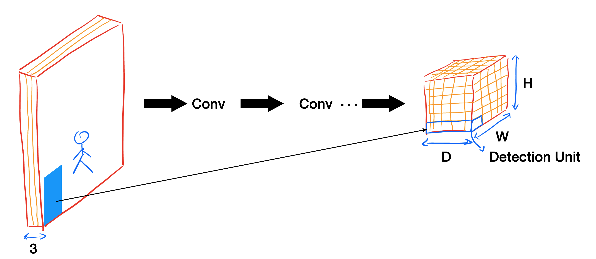
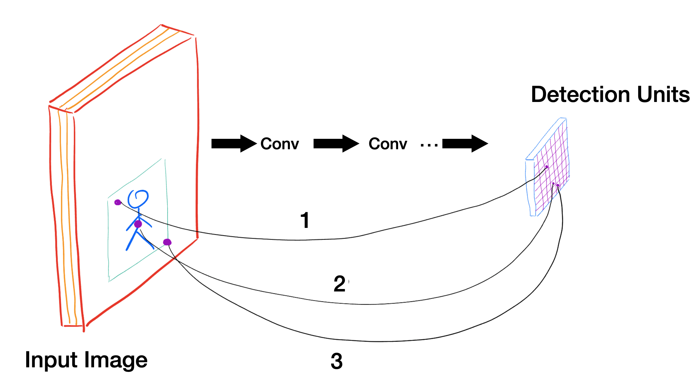
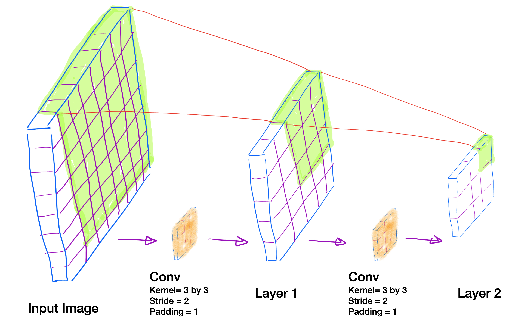

# YOLO Label Assignment Exploration Repository

Welcome to this repository, where I’ll be diving deep into the fascinating world of YOLO! Here, I aim to explore various aspects of the YOLO model. **Your feedback gives me a lot of motivation to keep exploring different facets of YOLO**—whether it's through creating issues, sending emails, or giving this repository a star if you find the content valuable. I'll start by discussing the label assignment problem in the YOLO series.

## Introduction

A core idea behind the YOLO series is how object detection happens in the final layer (or layers). How does a deep neural network output bounding boxes for all the objects in an image, along with their predicted classes? And with images containing a variable number of objects, how can the model flexibly handle and output different numbers of bounding boxes? Take a moment to consider how you might solve this before we dive deeper.

When an image is processed by a YOLO network, the output is a feature map structured as S × S × Depth. Each grid cell in the feature map corresponds to a specific region of the input image. For instance, the top left of the feature map corresponds to the top left of the image. I'll refer to each grid cell (Width × Height) as a "Detection Unit (DU)," with Depth representing the unit's depth.

Each detection unit in YOLO has a specific job: it either outputs the coordinates for a bounding box of an object or signals that no object was detected. Take YOLOv1 as an example, where the output consists of a 7x7 grid. So, there are 49 DUs in total. The key question is: If an image has two objects, which of these DUs is responsible for detecting the two objects?

To address this, the authors of YOLOv1 introduced what I call the idea of "local responsibility". They propose that a DU is responsible for detecting an object's bounding box if the object's center falls within the region covered by that DU in the overlaid grid. If no object center maps back to a particular DU, then that DU is not responsible for detection of any objects for that image.

Ground truth (GT) bounding boxes serve as labels, which must be assigned to specific DUs in a process known as "Label Assignment." Efficient label assignment is crucial, as it directly impacts how we define the loss function and begin the training process. In the previous paragraph, I touched on how YOLOv1 tackles this issue, and in the next section, I’ll delve deeper into Label Assignment and explore the innovative techniques introduced in different YOLO versions to make this process more efficient.

## YOLOv1

In YOLOv1, each Detection Unit has the following structure: x1,y1,width1,height1,objectnessscore1,x2,y2,width2,height2,objectnessscore2,classAprobability,classBprobability,…x1,y1,width1,height1,objectnessscore1,x2,y2,width2,height2,objectnessscore2,classA probability,classB probability,….  
This means each DU outputs two sets of bounding box coordinates along with corresponding objectness scores, and a set of class probabilities. For a dataset with 80 different classes, the total length of a DU would be 90: five values for the first bounding box, five for the second, and 80 class probabilities. Since YOLOv1 operates with a 7x7 grid, there are 49 DUs overall.

During training, for each image in a batch, we need to assign the ground truth bounding boxes to the appropriate Detection Units. Each DU can predict two bounding boxes. If the center of an object falls within a DU, that unit is responsible for detecting the object. But which of the two bounding boxes should be assigned to the ground truth? The answer is the one with the highest Intersection over Union (IoU) with the ground truth bounding box. The Objectness score of this bounding box is pushed toward 1, indicating a positive detection. The other bounding box, along with all other DUs that do not correspond to any object center, will have their Objectness scores pushed toward 0, indicating no object detected.

The reason YOLOv1 predicts two bounding boxes per DU, as explained in the video linked here, is that the model hopes one bounding box will specialize in detecting wide objects, while the other will specialize in detecting tall objects.

## YOLOv2, YOLOv3, PPYOLO, and PPYOLOv2

In YOLOv2, YOLOv3, PPYOLO, and PPYOLOv2, each DU can predict multiple bounding boxes. While the specific details of these predictions are not relevant to this section, the key idea is that when a GT center falls within a DU, the predicted bounding box with the highest IoU is assigned to that GT.

## YOLOv5

YOLOv5 introduces some modifications compared to previous versions. First, it retains the idea of assigning multiple bounding boxes in a DU to a GT object if the center of the object falls within that DU. However, instead of relying on Intersection over Union (IoU) as the matching criterion, YOLOv5 adopts a different measurement. It considers all anchor boxes whose maximum width-height ratio to the GT box is below a certain threshold as a match to the GT. In simple terms, YOLOv5 checks how much the predicted box needs to stretch or shrink in both width and height to fit the actual object. If the largest change is small enough (below a given limit), the predicted box is matched to the object.

More specifically, the ratio of the GT box height to the predicted box height is calculated, along with its reciprocal, and the maximum of the two is taken. The same process is done for the width. This gives us the largest change needed for either the GT or predicted box to adjust in width or height. Then, we calculate the maximum of these two values, meaning the maximum adjustment needed for either the width or height of the prediction. If this maximum adjustment is less than a certain threshold, a hyperparameter, the prediction is assigned to the GT.

There is also one more change: up to YOLOv4, if the center of an object fell into a DU, that DU would be solely responsible for detecting the object. In YOLOv5, this local responsibility extends to the neighboring non-diagonal DUs as well. So, if an object’s center falls into a specific part of a DU, like the top-left, not only that DU but also the immediate upper DU and immediate left DU will share responsibility for detecting the object.

[Documentation on YOLOv5](https://docs.ultralytics.com/yolov5/tutorials/architecture_description/#44-build-targets).

## FCOS

While we've explored several YOLO versions, it's important to discuss another key object detection method, FCOS, as its ideas are incorporated into later YOLO versions.

In the YOLO versions we discussed so far, only the DU corresponding to the object's center was used, ignoring other DUs whose mapping fell within the object’s bounding box but weren't at the center. For example, in this image, DU3 corresponds to the object's center, while other DUs that are mapped to some other part of the bounding box were unused. In FCOS, however, all DUs (including DU1, DU2, and DU3) within the bounding box are utilized. Instead of just one DU, every DU that falls within the bounding box is assigned to that GT. Unlike early YOLO versions, FCOS leverages all points within the ground truth bounding box to predict bounding boxes (while low-quality predictions are suppressed using the 'center-ness' branch).

The models we’ve discussed follow what I like to call “local responsibility,” meaning that if a detection unit (DU) lands on the center of an object in the input image, that DU is responsible for detecting the object. But what exactly do we mean by “falling on the center”? It’s actually pretty straightforward. The image is resized to fit the DU grid, and then the center of the object ends up in one of those DUs. (For example, in YOLOv5, this resizing happens at line 227 in the code).

This method of assigning DUs to GT objects comes from, as far as I understand, how convolutional neural networks (CNNs) operate and how their receptive fields span across an image. Given that, is there a more precise way to determine which DU corresponds to which GT object? The answer is yes—especially when working with a fully convolutional neural network. Chen and his colleagues tackle this in FCOS.
If you trace the convolutional kernels that result in a feature map, you can see how much of the input image that feature map has indirectly “seen,” or how far back the receptive field stretches through the preceding convolutional layers. For instance, in a simplified example, the top-right part of a feature map might correspond to all the green pixels in the input image. But here’s the thing: this creates a one-to-many relationship, and what we really need is to map each DU to a single pixel in the input image.

In their definition, Chen et al. consider the center of each pixel in the input image as the corresponding pixel for that DU. If that pixel is part of an object’s bounding box (and it doesn’t need to be the center of the bounding box), then all DUs whose corresponding pixels fall inside the bounding box will take responsibility for detecting the object. So, instead of simply overlaying the input image on the final feature map, they use a mathematical approach to trace the feature map back to the input image. For each location (x, y) on the feature map Fi, with s representing the total strides up to this feature map, they map it back to the input image as (⌊ s ⌋ + xs, ⌊ s ⌋ + ys), which is approximately the center of the receptive field for that location (x, y).

There are some nuances and special cases that go beyond the scope of this explanation, but feel free to dive deeper by checking out the full paper: [Chen et al., FCOS](https://arxiv.org/pdf/1904.01355).

## YOLOX
In YOLOX, each DU is responsible for detecting at most one ground truth (GT) object, but each GT can have more than one DU assigned to it. To improve label assignment, YOLOX introduces two key ideas.

The first idea stems from a comparison between FCOS and earlier YOLO versions (v1-v4). In FCOS, each DU is tied to a unique pixel in the input image, and if that pixel falls within a GT’s bounding box, the corresponding DU is responsible for detecting that object. Essentially, all DUs with pixels inside the GT’s bounding box are tasked with detection. In contrast, YOLO v1-v4 only assigns responsibility to a single DU—the one whose grid cell contains the center of the GT’s bounding box.

YOLOX takes a middle-ground approach. Rather than assigning responsibility to all DUs inside a GT’s bounding box (like FCOS) or just one (like YOLO v1-v4), YOLOX assigns responsibility to the center pixel and its immediate neighbors, forming a 3x3 grid, or 9 DUs in total. This method reduces the responsibility space from all DUs within the GT’s bounding box to just this localized area. By expanding the responsibility from just one DU (as in YOLO v1-v4) to 9 DUs, (but without involving every DU within the bounding box,) YOLOX achieves a 2.1% improvement in performance.

The second idea addresses how DUs are assigned to GTs in a global sense. Instead of relying on local responsibility (based on pixel location), YOLOX evaluates all possible DU-GT pairings to determine which ones should be considered positive matches. The challenge is deciding which pairings to keep and which to discard (assigning them to the background class). To solve this, YOLOX introduces a cost function based on a linear combination of classification and regression losses between each DU’s prediction and the GT. Then, they apply a variation of the optimal transport algorithm, which takes a global perspective on the assignment problem.

How a global perspective? Imagine two GTs, GT1 and GT2, with two DUs, DU1 and DU2. Initially, DU1 may appear to match GT1 best, and DU2 may seem better suited to GT2. However, assigning DU1 to GT2 and DU2 to GT1 may result in a lower overall loss, even if it isn’t ideal for the individual pairings. This global approach allows YOLOX to minimize the total loss across all DU-GT pairs. Their modified optimal transport algorithm, called simOTA, ranks DU predictions for each GT to minimize loss. The top k (dynamically determined) pairings are considered positive, while the rest are treated as background.

I need to note that YOLOX's cost function is a combination of both bounding box regression loss and classification loss. This combination allows the system to consider not just the accuracy of the bounding box for assignment but also the classification quality of the prediction. This is a key design insight, further elaborated in the TOOD paper, as it enhances how assignments are made by balancing both factors.

Given the huge search space of all possible DU-GT pairings, YOLOX narrows the candidates for each GT to the DU corresponding to its center pixel and its neighboring DUs within a specific radius (a hyperparameter). This reduced set is then passed to simOTA for final ranking. Incorporating this second idea, YOLOX achieves a further performance boost of 2.3%, compared to the 2.1% gain from the first idea alone.

## TOOD
The TOOD paper offers a lot of insights, but I’ll focus on its approach to label assignment. In their paper, they point out that most detectors use a bounding box regression score to assign a DU’s prediction to a GT, without considering the classification score. This creates a disconnect, as the optimal DU for classification and the optimal DU for bounding box regression are often different due to the lack of interaction between these two tasks. (Refer to the "task-agnostic sample assignment" section in the TOOD paper.) So, how can we design a learning method that considers both classification and regression quality simultaneously during training?

In TOOD, similar to YOLOX, all possible DU-GT pairs are initially considered. They then filter these pairs based on a calculated score. For each DU-GT pair, they compute a score, and for each GT, the top m DUs with the highest scores are assigned to that GT. What sets TOOD apart is how they define this score: it’s a non-linear combination of both the classification score and the bounding box regression score. 
Specifically, the classification score is raised to the power of a hyperparameter alpha, while the regression score is raised to the power of a hyperparameter beta, and then the two are multiplied together. This technique is called Task Alignment Learning (TAL).

TAL ensures that both classification and regression quality are considered together during training, addressing the issue of task misalignment. TAL has since been adopted in newer versions of YOLO, which we will discuss next.

## PPYOLOE, YOLOv6, YOLOv8, YOLOv9, YOLOv10, and YOLOv11
PPYOLOE, YOLOv6, YOLOv8, YOLOv9, YOLOv10, and YOLOv11 are either using TAL as label assignment (with some modifications) exclusively or use TAL and other methods for comparison.

In the YOLOv6 paper, there is a dedicated section for the comparison of different label assignment methodologies.  And TAL gets the best results in their comparative study.

YOLOv8, v10 and v11 use TAL; it does not consider all possible DU-GT pairs when using TAL. Instead for each GT, it filters the DUs that correspond to the pixels inside the bounding box of that GT (a smart way of shrinking the comparison space into the local candidates only.).

From what I understood of the YOLOv9 implementation, it can both use TAL label assignment and it can use some variations of the methodologies in YOLOv5.

## YOLOv7

## YOLOv7

The YOLOv7 codebase offers two different label assignment strategies: one similar to YOLOv5 (as seen in the code here) and another that uses the optimal transport algorithm, much like YOLOX (implemented here).  
A notable feature introduced in the YOLOv7 paper is the concept of auxiliary heads, which is an extension of the deep supervision method. While multiple detection heads have been a part of YOLO models since YOLOv3, the idea of auxiliary heads is presented as a way to improve the performance of the main detection heads. Essentially, in addition to the main detection head—which consists of multiple detection units (DUs)—the paper proposes auxiliary heads to further assist in generating better results. These heads are used during training and discarded during inference.  
The paper highlights a challenge they encountered: how to assign labels to these auxiliary heads in a way that complements the main detection heads. To address this, they introduce three methods of label assignment for auxiliary heads:

- **Independent Assignment:** The auxiliary heads receive label assignments independently, just like the main heads.  
- **Lead-Based Assignment:** The label assignment for an auxiliary head is based on the assignments made for the corresponding main (lead) head.  
- **Coarse-to-Fine Lead-Guided Assignment:** This is the method proposed by YOLOv7. It uses the label assignment from the main head as a guide for the auxiliary head but relaxes the assignment criteria. The idea is to generate a "coarse" label by allowing more grid cells to be considered positive targets, thus relaxing the constraints of the positive sample assignment.  

The reason behind this relaxation is explained in the paper: since auxiliary heads typically have weaker learning abilities compared to the main heads, loosening the assignment process helps them capture more information. The focus is on optimizing recall for auxiliary heads in the object detection task, ensuring they contribute to improving detection without missing important information. This "coarse-to-fine" approach helps to balance the auxiliary heads' performance by prioritizing recall, allowing them to support the lead head more effectively.

## Conclusion

It's fascinating to see how the label assignment problem has evolved over time. In YOLOv1-4, only the DU that lands on the center of a GT bounding box is assigned to that GT. YOLOv5 relaxes this a bit, extending responsibility to the DUs immediately surrounding the center as well. FCOS goes further by assigning responsibility to all DUs that fall within a GT’s bounding box.

YOLOX introduces a more balanced approach by assigning responsibility not only to the center DU but also to its neighboring DUs, while also considering a global view that minimizes the overall loss across all DU-GT pairs. TOOD builds on this idea by defining a score that accounts for both classification and regression simultaneously, similar to YOLOX in some ways.
